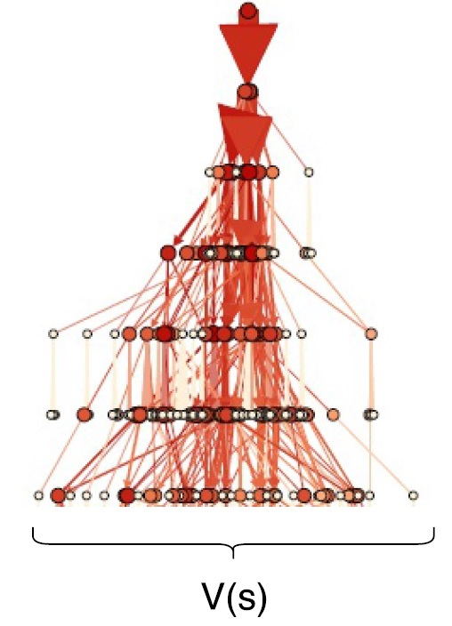

# DEPLER - Hybrid Statistical Control

DEPLER is a project that aims to study challenges and prospects of combining statistical online planning and deep learning of global models in single and multi-agent systems, both in discrete and continuous state and time domains. The project is an initiative of the [DARTS](README.md) team.

## Deep Experience Planning: Local Planning with Value Functions

Currently, we are studying the combination of statistical online planning with global value functions (or distributions) learned from prior experience in order to improve planning effectiveness. The idea is to combine the effectiveness and precise value estimations obtained by bounded statistical local planning with learned [value functions](https://en.wikipedia.org/wiki/Bellman_equation) capturing the general value distribution in the state space. While classical statistical planners use a heuristic value when they reach their simulation horizon, we instead estimate the value of the final state of a search trace with an estimated value learned from former experience of the agent. To enable generalization, we use a deep learning approach for modeling and training the value function estimate. [See here for more details on Deep Experience Planning](deep_experience_planning.md).

  

## A Framework for Research on Hybrid Model-Based Control

In the long term, we are thinking about providing a research platform for hybrid control approaches combining statistical online planning and learning. With the DEPLER framework, we hope to provide an attractive and easily accessible ecosystem to foster and accelerate research on hybrid model-predictive control based on combining local planning and global learning.

The DEPLER framework is inspired by a number of openly available platforms for control research: [OpenAI Gym](https://gym.openai.com/) and [Universe](https://universe.openai.com/), and the [GVGAI](http://gvgai.net/) competition.

- Gym and Universe focus on end-to-end reinforcement learning and transfer reinforcement learning. Have a look at Alex' [Deep Q-Embedding for Transfer Reinforcement Learning](http://public.mobile.ifi.lmu.de/public/theses/ma-thesis-alex-neitz.pdf) for a very interesting example in this direction. However, both Gym and Universe do not provide out-of-the-box simulations that allow to focus on model predictive control. Rather, an agent has to infer the simulation model from observations first. While this is an interesting task on its own, we think that the task of effective usage of the model is interesting and deserves focused research as well. Also, both Gym and Universe focus on single agent learning - currently, there are no multi-agent scenarios.

- The GVGAI framework is providing a simulation model for its domain out of the box. However, the focus in GVGAI is on competitive, high-performance game playing in discrete space and time domains. GVGAI agents always have a perfect model of the game available. Also, while there is a two-player GVGAI challenge, there are no team-based collaborative and/or competitive games such as capture the flag or king of the hill style scenarios. By the way: Flo achieved state-of-the-art results in the two player GVGAI competition. Watch out for Number 27 in [the GVGAI scoreboards](http://gvgai.net/gvg_rankings_conf_2p.php?rg=2004).

With DEPLER, we want to provide an open research environment with a number of baseline scenarios useful for studying hybrid control systems. We also want to provide implementations of baseline control algorithms to allow newcomers an easy start in this promising research direction. We think about providing parametrized model access: That is, scenarios may provide a parametrized distribution of models representing model uncertainty, rather than a perfect single model. Also, we think about parametrizable model errors to enable studying the robustness of control algorithms versus inadequate models.